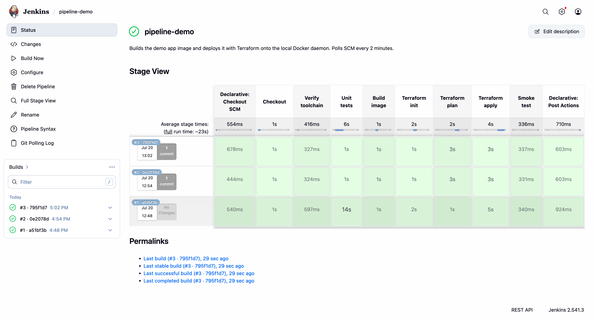
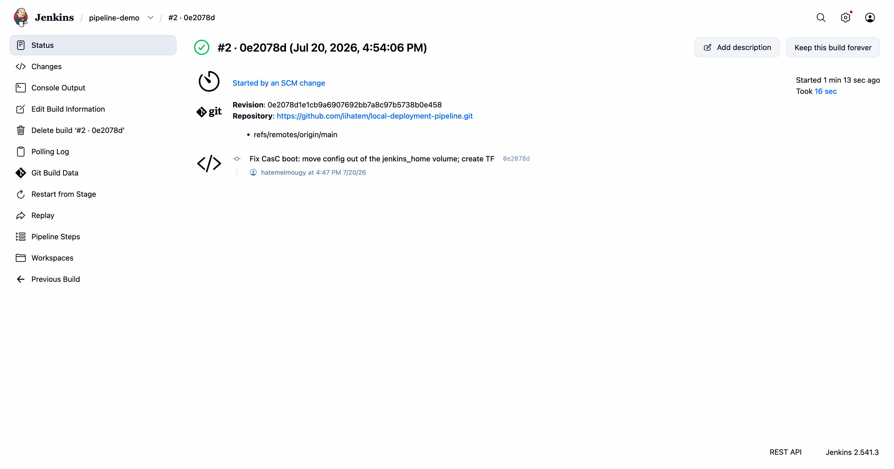
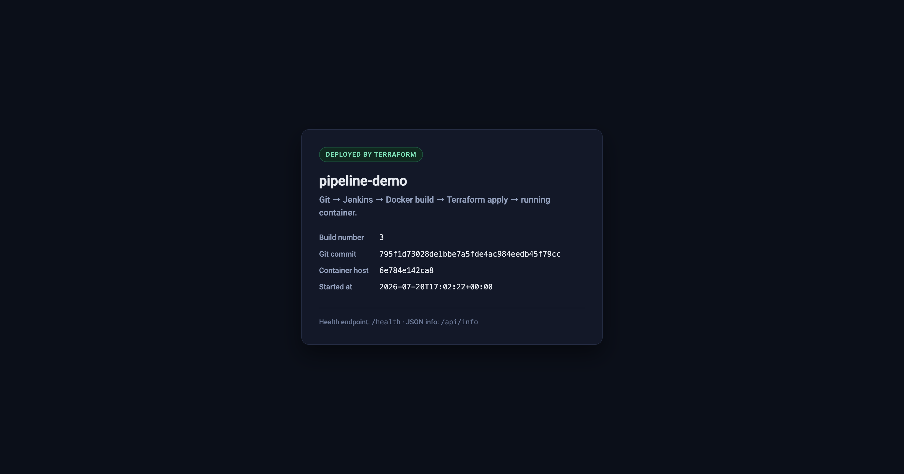

# Local Automated Deployment Pipeline — Report

## 1. Group members

| Name |
| ---- |
| Hatem Elmougy |

> _Working solo. If submitting as a group, add the remaining first and last names to this table
> before uploading to Canvas._

## 2. GitHub repository

**https://github.com/iihatem/local-deployment-pipeline**

Everything the pipeline needs is in that one repository: the application, its `Dockerfile`, the
`Jenkinsfile`, the Terraform configuration, and the Jenkins controller definition itself.

| Path | Role |
| ---- | ---- |
| `app/` | Flask application and its pytest unit tests |
| `Dockerfile` | Multi-stage app image (`--target test` runs the tests, `--target runtime` ships) |
| `Jenkinsfile` | The pipeline definition, including the SCM polling trigger |
| `terraform/` | `kreuzwerker/docker` provider config that deploys the container |
| `jenkins/Dockerfile` | Jenkins controller image with Docker CLI + Terraform baked in |
| `jenkins/casc.yaml` | Configuration-as-Code: admin user and the pipeline job with its 2-minute poll |
| `jenkins/docker-compose.yml` | Runs the controller with the host Docker socket mounted |

## 3. Explanation of the local setup

### How Jenkins connects to the local Docker daemon

Jenkins runs as a container, started from `jenkins/docker-compose.yml`. Two things make the
connection work:

1. **The controller image contains the Docker _client_ but no daemon.** `jenkins/Dockerfile`
   starts from `jenkins/jenkins:lts-jdk17` and installs `docker-ce-cli` plus Terraform 1.9.8,
   because stock Jenkins has neither and this pipeline runs both directly on the controller.

2. **The host's Docker socket is bind-mounted into the container:**

   ```yaml
   volumes:
     - /var/run/docker.sock:/var/run/docker.sock
   ```

   Every `docker build` Jenkins runs, and every container Terraform creates, is therefore executed
   by the **host's** Docker daemon rather than a nested one. This is the "docker-outside-of-docker"
   pattern, and it is why the deployed application shows up in a plain `docker ps` on the Mac
   alongside the Jenkins container itself.

The controller deliberately runs as **root**. On Docker Desktop for macOS the bind-mounted socket
is root-owned inside the container and there is no stable host `docker` group GID to add the
`jenkins` user to, so root is the pragmatic choice for a local lab. (Worth stating plainly:
handing a container the Docker socket is effectively giving it root on the host — fine on a
personal machine, not something to copy onto a shared CI server.)

### How Jenkins is configured

The controller is configured entirely as code via the Configuration-as-Code plugin
(`jenkins/casc.yaml`), so it boots with the setup wizard skipped, an admin user created, and the
`pipeline-demo` job already defined — no manual clicking. The job is a `pipelineJob` pointing at
this repository's `Jenkinsfile`.

One non-obvious detail: `casc.yaml` is copied to `/etc/jenkins-casc/jenkins.yaml`, deliberately
**outside** `/var/jenkins_home`. Jenkins home is a named Docker volume, and Docker only seeds a
volume from the image when the volume is empty — a config file stored there would be permanently
shadowed by the first run's copy, so rebuilding the image would silently change nothing. This was
found the hard way: the first boot attempt crash-looped, and edits to the config appeared to have
no effect until the file was moved off the volume.

### How the automatic trigger works

`pollSCM('H/2 * * * *')` in the `Jenkinsfile`, mirrored in `casc.yaml` so that polling is armed
from the very first boot rather than only after an initial manual build. Polling is used instead
of a webhook because GitHub cannot reach a Jenkins instance listening on `localhost`.

Build #1 in the screenshots below started on its own, from polling, with no manual trigger at all.

### What the pipeline does

`Checkout → Verify toolchain → Unit tests → Build image → Terraform init → plan → apply → Smoke test`

- **Unit tests** run via `docker build --target test`, so pytest executes against the exact
  dependency set that ships in the runtime image. A failing test fails the build before anything
  is deployed.
- **Build image** tags the result as both `pipeline-demo:<build-number>` and `pipeline-demo:latest`,
  baking the build number and commit SHA into the image as build args.
- **Smoke test** polls `http://host.docker.internal:8090/health` until the freshly deployed
  container answers, so a build only goes green if the deployment is genuinely serving traffic.

### How Terraform deploys the image

Terraform is the deployer. Jenkins has already built the image on the host daemon, so Terraform
does not pull anything — it looks the tag up and resolves it to an image ID:

```hcl
data "docker_image" "app" {
  name = var.image_name        # e.g. pipeline-demo:2
}

resource "docker_container" "app" {
  name  = var.container_name
  image = data.docker_image.app.id   # a sha256 image ID
  ports { internal = 5000, external = 8090 }
}
```

Feeding the resolved **image ID** into the container (rather than the tag) is what makes
redeployment work correctly: a rebuilt image produces a different sha256, which forces Terraform
to replace the container, while a rebuild with no code change plans zero changes.

**State.** The local state file lives at `/var/jenkins_home/terraform-state/pipeline-demo.tfstate`,
passed to `terraform init` with `-backend-config="path=..."`. Keeping it on the Jenkins volume
instead of in the job workspace means a workspace cleanup can never orphan a running container —
the next `apply` still knows exactly what it owns.

Terraform manages three resources: the container, a dedicated `pipeline-demo-net` bridge network,
and the image data lookup.

### Ports

| Service | URL |
| ------- | --- |
| Jenkins | http://localhost:8081 (admin / admin123) |
| Application | http://localhost:8090 |

## 4. Verification

### 4.1 Jenkins build history — builds triggered by commits



Three consecutive builds, every stage green, and **not one of them was started by hand**. Build
**#1** (`a51bf3b`) came from polling picking up the initial commit; builds **#2** (`0e2078d`) and
**#3** (`795f1d7`) each came from polling detecting a subsequent push — the sidebar shows "1
commit" against each.

### 4.2 Proof the build was triggered by a commit, not manually



The build page states **"Started by an SCM change"** and lists the repository, the revision
`0e2078d1e1cb9a6907692bb7a8c97b5738b0e458`, and the commit message that caused it. No one pressed
"Build Now".

### 4.3 The final application running in Docker



The page is served by the container Terraform deployed, and it reports the build number and commit
it was built from — `build 3`, commit `795f1d7…` — matching the most recent Jenkins build above.
That match is the end-to-end proof: a commit pushed to GitHub became a running container without
human intervention.

### 4.4 Docker-side verification

Captured after build #3 (raw output also committed at `docs/verification-output.txt`):

```
$ docker ps --filter name=pipeline-demo --filter name=jenkins
NAMES           IMAGE                    STATUS                    PORTS
pipeline-demo   ab02b5ee39d2             Up 29 seconds (healthy)   0.0.0.0:8090->5000/tcp
jenkins         pipeline-jenkins:local   Up 15 minutes             0.0.0.0:8081->8080/tcp, 0.0.0.0:50001->50000/tcp

$ docker images pipeline-demo
REPOSITORY      TAG       IMAGE ID
pipeline-demo   3         ab02b5ee39d2
pipeline-demo   latest    ab02b5ee39d2
pipeline-demo   2         323d5a297b9b
pipeline-demo   1         3f1566083204

$ curl -s localhost:8090/api/info
{"app":"pipeline-demo","build_number":"3","git_commit":"795f1d73028de1bbe7a5fde4ac984eedb45f79cc", ...}

$ docker network ls --filter name=pipeline-demo-net
NETWORK ID     NAME                DRIVER    SCOPE
5b4714c84b31   pipeline-demo-net   bridge    local
```

Both the Jenkins controller and the deployed application are containers on the same local daemon.
The image history shows one image per build, and the container is running the tag from the most
recent build with a passing healthcheck.

### 4.5 Terraform is genuinely managing state

Re-planning against the unchanged deployment reports no drift, and the state file tracks all three
resources:

```
$ terraform plan ...
docker_container.app: Refreshing state... [id=208a665b2957...]
No changes. Your infrastructure matches the configuration.

$ terraform state list
data.docker_image.app
docker_container.app
docker_network.app
```

## 5. Requirements checklist

| Requirement | How it is met |
| ----------- | ------------- |
| **Git/GitHub** hosts app code, Dockerfile, Jenkinsfile, and `.tf` files | Single repo, layout table in §2 |
| **Automated CI trigger** on repository updates | `pollSCM('H/2 * * * *')`; build #2 shows "Started by an SCM change" (§4.2) |
| **Jenkins** checks out, builds the image, runs `terraform apply` | Stage view in §4.1 — all stages green |
| **Terraform** uses `kreuzwerker/docker`, reads local state, deploys the built image | §3 "How Terraform deploys the image", verified in §4.5 |
| **Docker** hosts both Jenkins and the deployed app | `docker ps` in §4.4 shows both containers |

## 6. Reproducing from scratch

```bash
git clone https://github.com/iihatem/local-deployment-pipeline.git
cd local-deployment-pipeline
docker compose -f jenkins/docker-compose.yml up -d --build

# Jenkins: http://localhost:8081  (admin / admin123)
# The pipeline-demo job already exists and begins polling immediately.
# Within ~2 minutes it builds and deploys on its own:
open http://localhost:8090
```
